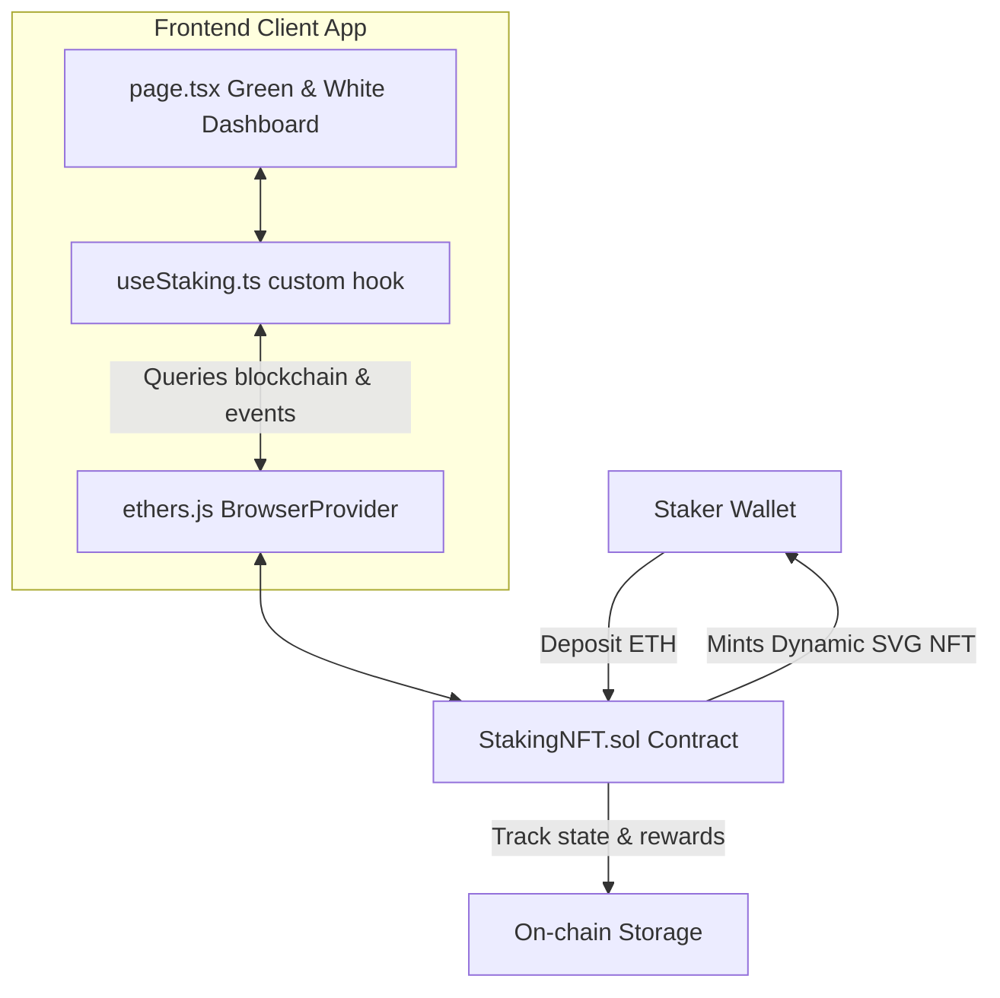

# EtherStaker NFT - Dynamic Staking Portal

A premium, high-performance, and secure NFT-based Ethereum Staking DApp. Users deposit native ETH to mint dynamic, on-chain SVG representation tickets that accumulate yields in real time.

---

## 🚀 Deployed Addresses & Links

* **Sepolia Testnet Smart Contract:** [`0x8C869B926afd26a3CB8F144794cCFcdb13B3aF0F`](https://sepolia.etherscan.io/address/0x8C869B926afd26a3CB8F144794cCFcdb13B3aF0F)
* **Deployed Frontend URL:** `[https://staking-nine.vercel.app]` 

---

## 🏛 Architecture Overview



### 1. Smart Contract (`contract/contracts/StakingNFT.sol`)
* **Dynamic On-chain Artwork**: The visual ticket artwork is constructed inside the contract bytecode using Solidity string manipulation, Base64-encoding an SVG containing the position details (staked amount, reward multiplier, and lock time).
* **Token Economics**: Yields a fixed rate of **20% every 5 days** (~4.00% daily rate).
* **Early Unstaking Rules**: Employs a strict **24-hour lock period**. Withdrawing principal before lock expiration incurs a **5% penalty** on the staked principal, which is redirected to the rewards treasury.
* **Security & Recovery**: Protected via OpenZeppelin's `Pausable`, `ReentrancyGuard`, and `Ownable`. Includes an **Emergency Mode** for stakers to instantly recover their principal without penalties if needed.

### 2. Frontend Custom Hook (`frontend/app/hooks/useStaking.ts`)
* Implements Ethers.js v6 connection parameters.
* Synthesizes a real-time pending reward simulation updated every second on-screen so users see rewards tick up without paying gas.
* Listens to live logs (`StakeCreated`, `RewardClaimed`, etc.) and automatically synchronizes dashboard state when transactions are completed.

### 3. Flat Green & White UI (`frontend/app/page.tsx`)
* Clean, gradient-free modern financial interface using emerald green and slate tones.
* Direct integration of dynamic on-chain SVG rendering inside position cards.
* Interactive transfer input allowing users to transfer ownership of their staking position NFT to any Ethereum address directly from the card.

---

## 🛠 Setup & Run Instructions

### Prerequisites
* [Node.js](https://nodejs.org/) (v18+ recommended)
* [MetaMask Wallet](https://metamask.io/) extension configured with Sepolia Testnet or localhost network.

---

### Part 1: Smart Contract Setup

1. Navigate to the contract folder:
   ```bash
   cd contract
   ```

2. Install dependencies:
   ```bash
   npm install
   ```

3. Configure environment variables (create a `.env` file):
   ```ini
   SEPOLIA_RPC_URL="https://sepolia.infura.io/v3/YOUR_KEY"
   PRIVATE_KEY="YOUR_WALLET_PRIVATE_KEY"
   ETHERSCAN_API_KEY="YOUR_ETHERSCAN_KEY"
   ```

4. Compile and run local Hardhat tests:
   ```bash
   npx hardhat test
   ```

5. Deploy locally (optional):
   ```bash
   npx hardhat node
   npx hardhat ignition deploy ignition/modules/StakingNFT.js --network localhost
   ```

6. Deploy to Sepolia:
   ```bash
   npx hardhat ignition deploy ignition/modules/StakingNFT.js --network sepolia
   ```

---

### Part 2: Frontend Dashboard Setup

1. Navigate to the frontend folder:
   ```bash
   cd ../frontend
   ```

2. Install dependencies:
   ```bash
   npm install
   ```

3. Run local development server:
   ```bash
   npm run dev
   ```
   *The DApp will be available at `http://localhost:3000`.*

4. Build production bundle:
   ```bash
   npm run build
   ```
